# zoldyck

## Table of contents
- [zoldyck](https://github.com/AmienKhaled/zoldyck#zoldyck)
- [package content](https://github.com/AmienKhaled/zoldyck#package-content)
- [Installation](https://github.com/AmienKhaled/zoldyck#installation)
- [How To Use it](https://github.com/AmienKhaled/zoldyck#how-to-use-it-)
  - [Setup webhooks](https://github.com/AmienKhaled/zoldyck#1-setup-webhooks)
  - [Subscribe your page and Token Generation](https://github.com/AmienKhaled/zoldyck#2-subscribe-your-page-and-token-generation)
- [The exciting part Making chatbot respond](https://github.com/AmienKhaled/zoldyck#the-exciting-part-making-chatbot-respond)
  - [get and set important data](https://github.com/AmienKhaled/zoldyck#1--get-and-set-important-data)
  - [Send text message](https://github.com/AmienKhaled/zoldyck#1--send-text-message)
  - [Send media message](https://github.com/AmienKhaled/zoldyck#2--send-media-message)
  - [Send quick replies](https://github.com/AmienKhaled/zoldyck#3--send-quick-replies)
  - [Send temps](https://github.com/AmienKhaled/zoldyck#4--send-temps)
    - [generic temp](https://github.com/AmienKhaled/zoldyck#41--generic-temp)
    - [List Template](https://github.com/AmienKhaled/zoldyck#42--list-template)
    - [Receipt Template](https://github.com/AmienKhaled/zoldyck#43--receipt-template)
  - [Get text from voice message](https://github.com/AmienKhaled/zoldyck#4--get-text-from-voice-message)


## zoldyck
**zoldyck** is Universal Package for making Chatbots easy .
this version 1.0, and it include only facebook messenger
next version we will add another platform
and we appreciate your contribution

## Package content
Here is the full package content and feature
but below is the simple tutorial 
full package documentation well be avilable soon ! 

**content**
- [Text message](http://github.com)
- [Media message](http://github.com)
  - [By URL](http://github.com)
  - [BY Assest Id](http://github.com)
- [Quick replies](http://github.com)
  - [Text](http://github.com)
  - [Location](http://github.com)
  - [Email](http://github.com)
  - [Phone](http://github.com)
- [Template](http://github.com)
  - [Generic Template](http://github.com)
  - [List Template](http://github.com)
  - [Open Grap Template](http://github.com)
  - [Media Template](http://github.com)
  - [Receipt Template](http://github.com)
- [Buttons](http://github.com)
  - [Url Button](http://github.com)
  - [URl Button With Message Extention](http://github.com)
  - [Postback Button](http://github.com)
  - [Share Button](http://github.com)
  - [Buy Button](http://github.com)
  - [Call Button](http://github.com)
- [Operation](http://github.com)
  - [Get Attachement Link](http://github.com)
  - [Get Reception Id](http://github.com)
  - [Get Message sent Type](http://github.com)
  - [Get Received Text](http://github.com)
  - [Get Postback Payload](http://github.com)
  - [Get Postback Title](http://github.com)
  - [Get Quick Reply Payload](http://github.com)
  - [Get latitude and longitude](http://github.com)
  - [Get text from voice message](http://github.com)

## Installation

```python
 pip install zoldyck
```

## How To Use it :
here it is a simple tutorial for how package work
and full ducomentaion for all features will be published soon !

to get full advantages of of the package you should read
doc of facebook APIs link .

### 1-Setup webhooks

first you should have facebook Page

then you should go to [link](https://developers.facebook.com/) and create new app 

<p align="center">
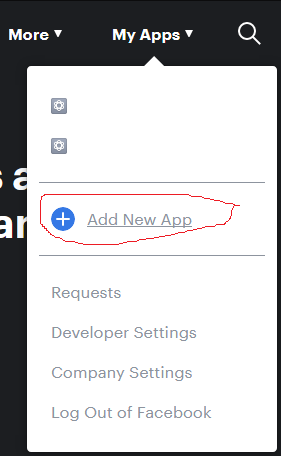
</p>

give it name and email for contact

<p align="center">
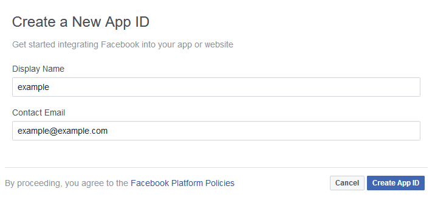
</p>

setup messenger 

<p align="center">
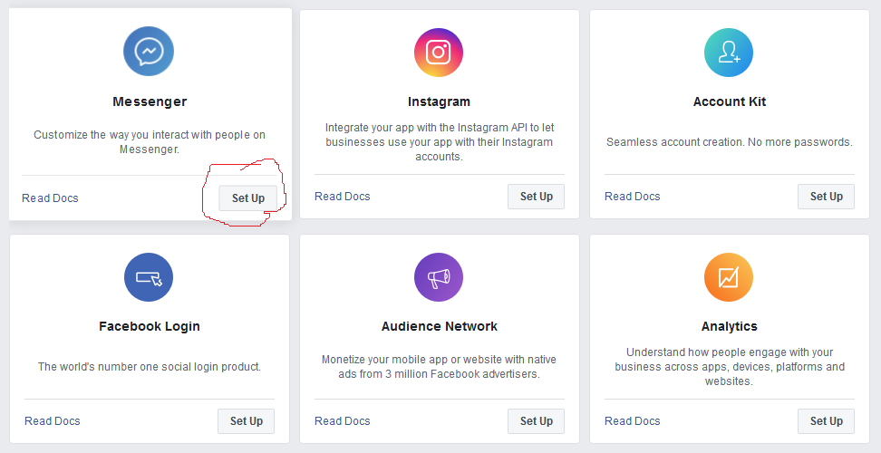
</p>

click setup webhook button

<p align="center">
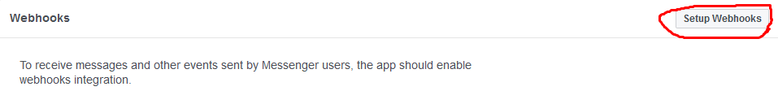
</p>
 
give link to your server 

and give also token and remember it cause you 
will use it later in the code

check messages and messaging_postbacks

<p align="center">
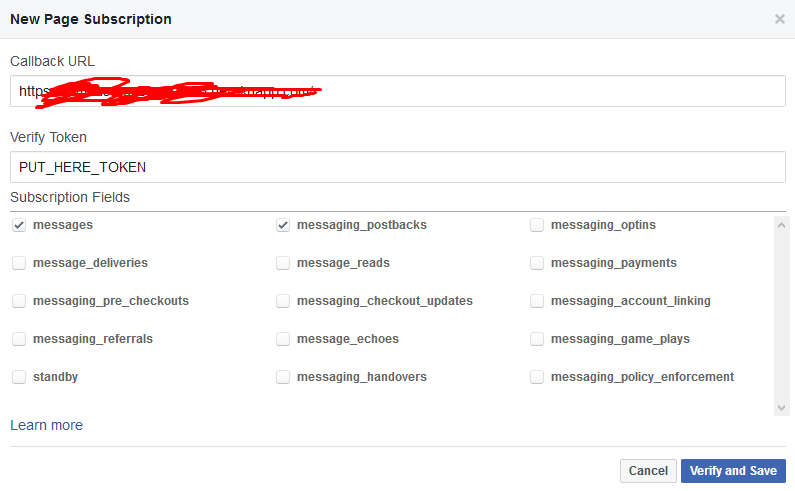
</p>


in your server side you can use and frame work like 
django or falsk , but in this tutorial i will assume
you are using django

so to complete webhooks setup
 you should check for GET requests 

```python
from zoldyck.messengerBot.messenger import messenger

@csrf_exempt
def index(request):

    bot = messenger()
    bot.VERIFY_TOKEN = "TONA"
    if request.method == 'GET':
        token_sent = request.GET.get("hub.verify_token")
        if bot.Verify_Token(token_sent):
            return HttpResponse(request.GET.get("hub.challenge"))
        return HttpResponse("Error")
```

if you make all above steps right it will verviy and save easily

### 2-Subscribe your page and Token Generation 

first select your page
second save you token cause you will use it later
third subsubscribe your page to webhook

<p align="center">
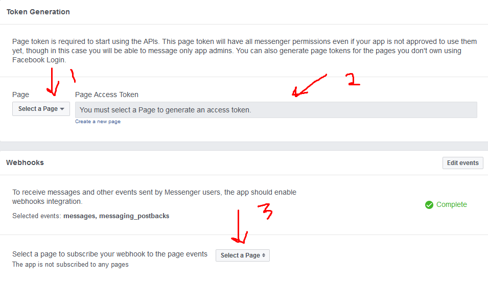
</p>


## The exciting part Making chatbot respond

### 1- get and set important data
we should first set basic parameters like access token
and get data "json object" sent to your server
to get info like sender id and message type (text, image, video, ...etc)
```python
    elif request.method == 'POST':
        #set acces token
        bot.ACCESS_TOKEN = "out here your access token from the previous step"

        #get json facebokk sent to your server
        all_json = json.loads(request.body.decode('utf-8'))

        #get sender's id
        recipient_id = bot.returnReceptionId(all_json)

        #Optional you can check the type of message sent by user (text, image, video, file, quick reply, postback)
        json_type = bot.returnJsonType(all_json)

```
##

### 1- Send text message
<p align="center">
  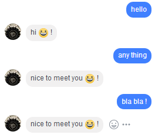
</p>


assuming some one send message to your chatbot

this example below get message sent by user and check if it is text message
then check again if the massege is `hi :D !` it will send hi
else it will sent `nice to meet you :D !`

```python
        received_msg =""
        if json_type == "text":
            received_msg = bot.returnReceivedText()

        #send message
        if received_msg == "hello" :
            your_msg = "hi :D !"
            #it will return json to send it directly
            msg_json = bot.createTextMsgJson(recipient_id, your_msg, msg_type ="RESPONSE")
        else :
            your_msg = "nice to meet you :D !"
            #it will return json to send it directly
            msg_json = bot.createTextMsgJson(recipient_id, your_msg, msg_type ="RESPONSE")

        #it will send and it will return the staus of the request
        response = bot.sender(msg_json)
```
##

### 2- Send media message

<p align="center">
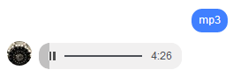
</p>

example

here we will send music by media message when user send mp3

```python
    if received_msg == "mp3" :
        #link to mp3 
        mp3_link ="https://a.tumblr.com/tumblr_lxsmshwZE41r1be1no1.mp3"
        #it will return json to send it directly
        your_msg = bot.createMediaByURLJson(mp3_link, recipient_id, "audio")
    #it will send and it will return the staus of the request
    response = bot.sender(your_msg)
```
you can try typing on , seen and, typing off
usin this fuction `bot.creatTypingStatusJson()`
[link](https://developers.facebook.com/docs/messenger-platform/send-messages/sender-actions) for more

##

### 3- Send quick replies


<p align="center">

</p>

example

here we will send all kind of quick replies buttons when user send quick
**note** :you can only send on type on more than that check this [link](https://developers.facebook.com/docs/messenger-platform/send-messages/quick-replies) for more


```python
fullJson= {}
if received_msg == "quick" :
    #simple text quick reply
    temp = bot.creatTextQuickReplyJson("text reply", "payload which you want to be sent to you server when user press it" , "https://png.icons8.com/material/1600/delicious.png" )
    #add reply to list
    arrayofquicks = bot.addObject(temp)

    #location reply
    temp = bot.creatLocationQuickReplyJson( )
    #add reply to the prevoius on in the list
    arrayofquicks = bot.addObject(temp , arrayofquicks )

    #email reply allow user to send his/her email by press it
    temp = bot.creatEmailQuickReplyJson( "payload which you want to be sent to you server when user press it" , "link to png icon to your button")
    #add reply to the prevoius on in the list
    arrayofquicks = bot.addObject(temp , arrayofquicks )

    #email reply allow user to send his/her phone number by press it
    temp = bot.creatPhoneNumberQuickReplyJson("payload which you want to be sent to you server when user press it", "link to png icon to your button")
    #add reply to the prevoius on in the list
    arrayofquicks = bot.addObject(temp , arrayofquicks)
    #it will return json to send it directly
    fullJson = bot.creatFullRepliesWithTextJson(recipient_id, "pick reply", arrayofquicks)
#it will send and it will return the staus of the request
response = bot.sender(fullJson)
```

**note** : you can get location and quick reply payload
from these functions `returnLatAndLong`, `getQuickReplyPayload`

##

### 4- Send temps

#### 4.1- generic temp
example

here we will send generic template when user send gen_temp

<p align="center">
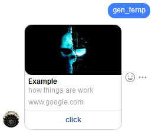
</p>


first you should see full json body [here](https://developers.facebook.com/docs/messenger-platform/reference/template/generic)

```python
temp = {}
if received_msg == "gen_temp" :

    #build defauld part
    default = bot.createDefaultActionJson("www.google.com")
    url = "url to image for the temp"

    #create button
    button = bot.createUrlButtonJson("put here link to site you want", "click")
    #add button to the array
    array_of_buttons = bot.addObject(button)

    #create element -body-
    element = bot.createElementWithButtonJson("Example", "how things are work", url, default, array_of_buttons)
    #add element yo the array
    arrayof_elemnts = bot.addObject(element)

    #it will return json to send it directly
    temp = bot.createGenericTempleteJson(recipient_id, arrayof_elemnts)
    #it will send and it will return the staus of the request
response = bot.sender(temp)
```

**notes** :

1-you can change type of button you can use postback buttons `createPostbackButtonJson()`

1-you can send more than temp by just create more elments
and add it to array


#### 4.2- List Template
example

here we will send List template when user send list_temp

<p align="center">
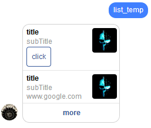
</p>

first you should see full json body [here](https://developers.facebook.com/docs/messenger-platform/reference/template/list)

```python
temp = {}
if received_msg == "list_temp" :

    #build defauld part
    default = bot.createDefaultActionJson("https://www.google.com")
    url = "url to image for the temp"

    #create button
    button_for_element1 = bot.createUrlButtonJson("https://www.google.com", "click")
    #add button to the array
    array_of_buttons1 = bot.addObject(button_for_element1)

    #create element -body-
    element1 = bot.createElementWithButtonJson("title", "subTitle", url, default, array_of_buttons1)
    #add element yo the array
    arrayof_elemnts = bot.addObject(element1)

    #create element -body-
    element2 = bot.createElementJson("title", "subTitle", url, default)
    #add element yo the array
    arrayof_elemnts = bot.addObject(element2 ,arrayof_elemnts)

    #create button
    button_in_bottom_of_temp = bot.createUrlButtonJson("link to site", "google")
    #add button to the array
    array_of_buttons2 = bot.addObject(button_in_bottom_of_temp)

    #it will return json to send it directly
    temp = bot.createListTemplateWithButtonJson(recipient_id, arrayof_elemnts , array_of_buttons2)

#it will send and it will return the staus of the request
response = bot.sender(temp)
```

#### 4.3- Receipt Template

example

here we will send Receipt template when user send re_temp

<p align="center">
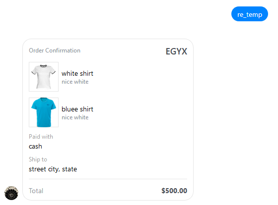
</p>

when you click it 

<p align="center">
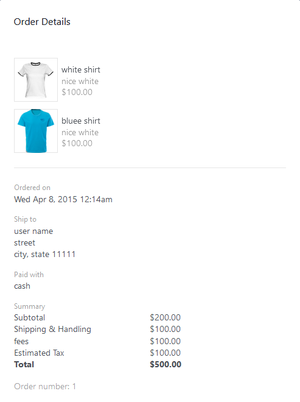
</p>

first you should see full json body [here](https://developers.facebook.com/docs/messenger-platform/reference/template/receipt)

```python
temp = {}
if received_msg == "re_temp" :
    #create address of order
    address  = bot.createReceiptTemplateAddressJson("street", "city", "11111", "state", "country")

    #create summary of order
    summary  = bot.createReceiptTemplateSummaryJson(500, 200, 100, 100)

    #create Adjustment of order
    adjus    = bot.createReceiptTemplateAdjustmentJson("fees", 100)
    #add Adjustment to list
    arrayofadjustments    = bot.addObject(adjus)

    #create element -product-
    element1 = bot.createReceiptTemplateElementsJson("white shirt", 100, "nice white", 1, "USD", "https://pngimg.com/uploads/tshirt/tshirt_PNG5441.png")
    #add element to list
    array_elements = bot.addObject(element1)

    #create element -product-
    element2 = bot.createReceiptTemplateElementsJson("bluee shirt", 100, "nice white", 1, "USD", "http://pngimg.com/uploads/tshirt/tshirt_PNG5436.png")
    #add element to list
    array_elements = bot.addObject(element2, array_elements)
    #it will return json to send it directly
    temp = bot.createReceiptTemplateJson(recipient_id, "user name", "1", "USD", "cash", "https://www.google.com", summary, "1428444852", address, arrayofadjustments, array_elements)

#it will send and it will return the staus of the request
response = bot.sender(temp)
```


### 4- Get text from voice message

example

here we will send voice note saying "hello world" then bot will
extract the text from the voice and return it as text message

<p align="center">
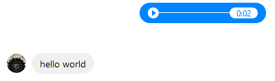
</p>

it allow you to extract text from voice note sent by user
```python
#get type of msg sent by user
json_type = bot.returnJsonType(all_json)
msg_json = {}

#check if msg is audio type
if json_type == "audio":
    #get link of audio
    url = bot.getAttachementLink(all_json)
    #convert voice to text
    txt = bot.voiceNoteToText(recipient_id, url, "en-US")
    #it will return json to send it directly
    msg_json = bot.createTextMsgJson(recipient_id, txt, msg_type="RESPONSE")
#it will send and it will return the staus of the request
response = bot.sender(msg_json)
```
